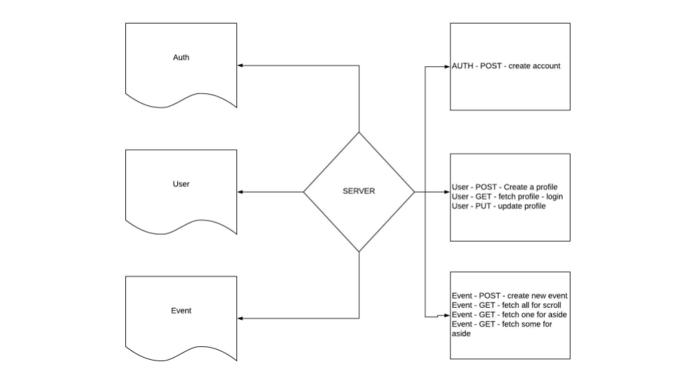

# EventUs Back-end

## Overview 
This the back-end to the EventUs application and is intended to be a social media platform organized around events localized around the user. It stores and persists data via Mongoose and a MongoDB, with the data being provided by the user. The application is built with Node.js and utilizes an Express.js server with custom middleware and authentication. 

## Getting Started 

EventUs API is available at `https://github.com/EventUs-CF`. 

## Schema Structure 

### Account Schema
- Fields that are required and unique are 'username', 'email' 
- A required field of 'password'

#### POST /signup 
This route is designed to take the input of the form and ensure that a new account is created with a proper security token for accessing other routes in the application. This includes verification for inputs and ensuring clean database entries.

#### GET /login  
Verifies if you are an existing user, allowing login and returns a unique token for accessing other application endpoints. 

### User Schema 
This Schema has a one to one relationship to the Account Schema and a one to many relationship to the Event Schema. The User Schema contains the profile for the individual logged in user. 

#### POST /user 
This route is to create a user upon successful profile completion and returns the new user profile. 
- Fields that can be filled, 'username', 'email', 'bio' and 'avatar' (image). 

#### GET /user 
This route is used to fetch the current logged in user's profile. 

#### PUT /user/:id 
This route is designed to update fields that are different from the current values of the given logged in user's profile.
- Fields that can be updated, 'username', 'email', 'bio' and 'avatar' (image). 

### Event Schema
The Event Schema has both a one to one and many to one relationship with the User Schema. In order to create, update or delete an event you must be both logged in and be the owner of the event. 

#### POST /event
This route is responsible for taking input from the Event Form and creating a new event with the following fields
- Fields that are required: 'title', 'startDate', 'location', 'cost', 'runNumber', 'keywords' and 'createdBy'.
- Fields that are present that can be used: 'attendees' (pointer to User Schema), 'permissions', 'threads' and 'createdOn'. 
- Returns the newly created event

#### GET /events/
This route is designed to retrieve all of the current Events that are populated in the database. 
- Returns array of Event objects.

#### GET /events/:id
This route is designed to retrieve a specified Event that has an ID that is passed as the parameters of the request. All fields intially written are currently mutable. 
- Returns Event object at the given ID value.

#### PUT /events/:id
This route is designed to update a specified Event that has an ID that is passed as the parameters of the request. 
- Returns Event object at the given ID value.

#### DELETE /events/:id
Deletes a specified Event from the database.
- No return value expected.

## Architecture 
The back-end of this application was created and deployed with the following technology: 

Vanilla JavaScript, Node.js, body-parser, Express.js, superagent, http-errors, Mongoose, jest and faker for testing, eslint for syntactically correct code.  

## Testing 
In order to test please ensure you have access to the Jest test suite. To run the tests for the back-end please type the following into your CLI(Command Line Interface).

    npm run dbon
    npm test

When finished testing please remember to turn off your MongoDB

    npm run dboff

Collective thanks to all of the Teacher's Assistants, Vinicio and the other staff at Code Fellows.